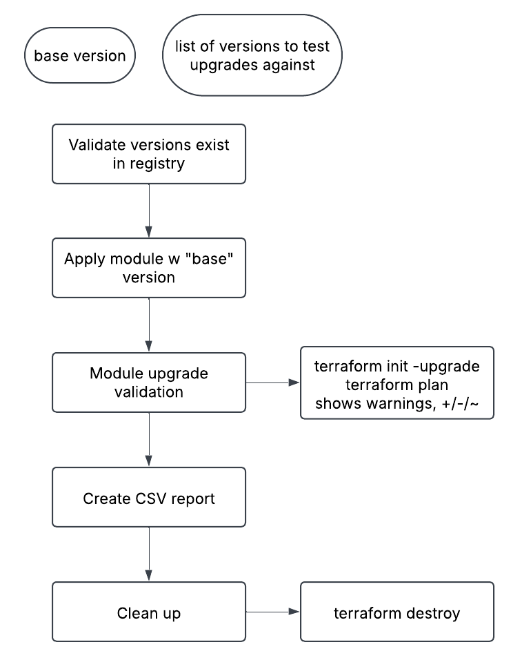
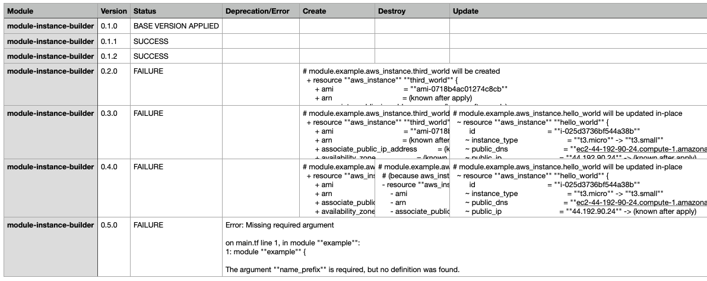

# Module Upgrade Tester

This repository contains a Jenkins pipeline and supporting scripts to test Terraform module upgrades. The pipeline validates the compatibility of a base module version with a list of newer versions by applying the base version, upgrading to each target version, and creating a report of possible changes.

## Files

- **`Jenkinsfile`**: The main Jenkins pipeline script.
- **`replace_version.py`**: A Python script to update the module version in Terraform configuration files.
- **`plan_extractor.py`**: A Python script to parse Terraform plan logs and extract resource changes into a CSV file.

## Prerequisites

- Jenkins with the following plugins:
  - Pipeline
  - Git
- Terraform CLI installed on the Jenkins agent.
- Python 3 installed on the Jenkins agent.
- Access to a Terraform Cloud/Enterprise organization for deploying modules.
- Credentials for GitHub and Terraform Cloud/Enterprise.

## Module Prequisites:
- `examples/` holds `module{}` blocks with version specified
- Module versions tested are already published in registry
- Modules published in VCS with git tags with valid examples of module deployment of that version

[Example module](https://github.com/itsphoebe/terraform-aws-instance-builder) used to test this pipeline

## Pipeline Parameters

| Parameter                | Description                                                                                     |
|--------------------------|-------------------------------------------------------------------------------------------------|
| `MODULE_NAME`            | Name of the module to test.                                                                    |
| `PROVIDER`               | Provider of the module (e.g., `aws`).                                                          |
| `GIT_REPO_URL`           | Git repository URL to clone.                                                                   |
| `GIT_BRANCH`             | Git branch to clone.                                                                           |
| `BASE_VERSION`           | Base version of the module to test against.                                                    |
| `MODULE_VERSIONS`        | Comma-separated list of module versions to test upgrading to.                                   |

## High Level Pipeline Flow

The following diagram illustrates the overall flow of the pipeline:

## Pipeline Tips

- Deploy under an ephemeral workspace (TFE v202502-2) to ensure destruction of temporary resources
- Workspace using Vault backed dynamic credentials to AWS, no issues worrying about timeout since credentials will be valid for the duration of the run

## Example Output

The pipeline generates a CSV report (`module_upgrade_results.csv`) that looks like:

## Customizing the Pipeline for Your Environment

The code is an example! You'll need to tweak the code to make it work for you.
If you want to use this pipeline in your own environment, you may need to make the following changes:

1. Terraform Cloud/Enterprise (TFE) Instance URL
2. Organization Name
3. Workspace Name
4. Read through the [module preqs](#module-prequisites), the pipeline was written with a specific module structure in mind
